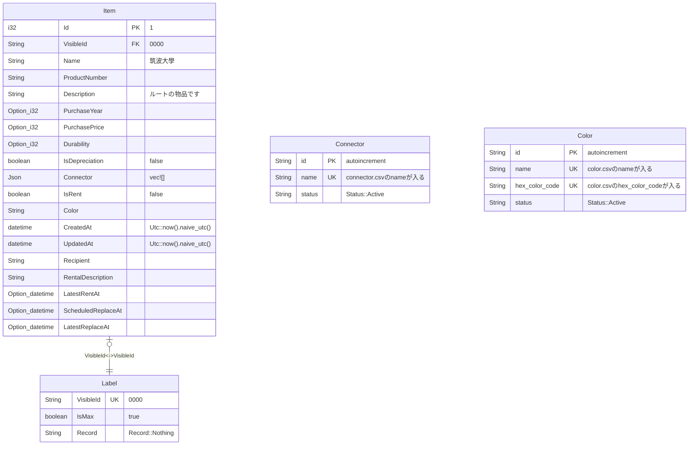

# Service and Container

## RDB (Container)

- PostgreSQL

## GraphDB (Container)

- Neo4j

## Meilisearch (Container)

- Meilisearch

## Object Strage (Service)

- Cloudflare R2

# 構造

server では、Layered Architecture を採用している

※ SeaORM を採用している関係で構造が乱れているが、 SeaORM を使用する場合はこの構造のままの方が使いやすいので、この構造のままにしている


## presentation

- src/presentation 以下の binary crate

## application

- src/application 以下の library crate

## domain

- src/domain 以下の library crate

## infrastructure

- src/infrastructure 以下の library crate
- migration
- entity

# 開発環境

## 開発環境の構築

### 0. .envの設置

シークレットな情報のため、詳細はscrapbox参照

### 1. docker-compose up

```sh
docker-compose -f db.compose.yaml up -d
```

### 2. .envの編集

シークレットな情報のため、詳細はscrapbox参照

### 3. server の起動

```sh
cargo run --bin presentation
```

## 開発環境の削除

```sh
docker-compose -f db.compose.yaml down --rmi all --volumes
sudo rm -rf postgres neo4j meilisearch init
```

# 本番環境の構築

### 0. .envの設置

シークレットな情報のため、詳細はscrapbox参照

### 1. docker-compose up (db)

```sh
docker-compose -f db.compose.yaml up -d
```

### 2. .envの編集

シークレットな情報のため、詳細はscrapbox参照

### 3. docker-compose up (server)

```sh
docker-compose -f server.compose.yaml up -d
```

## 開発環境の削除

```sh
docker-compose -f db.compose.yaml down --rmi all --volumes
docker-compose -f server.compose.yaml down --rmi all --volumes
sudo rm -rf postgres neo4j meilisearch init
```

## テーブルの更新

### 1. docker-compose up

```sh
docker-compose -f entity.compose.yaml up -d
```

### 2. Migration

```sh
cargo run --manifest-path ./migration/Cargo.toml -- refresh -u postgres://<POSTGRES_USER>:<POSTGRES_PASSWORD>@localhost:<POSTGRES_PORT>/<POSTGRES_DB>
```


### 3. Entityの生成

```sh
sea-orm-cli generate entity \
    -u postgres://<POSTGRES_USER>:<POSTGRES_PASSWORD>@localhost:<POSTGRES_PORT>/<POSTGRES_DB> \
    -o entity/src
```

# 製品版の環境

## 製品版の環境の構築

```sh
docker-compose -f prod.compose.yaml up -d
```

# 初期データ

## RDB



## Meilisearch


## GraphDB


